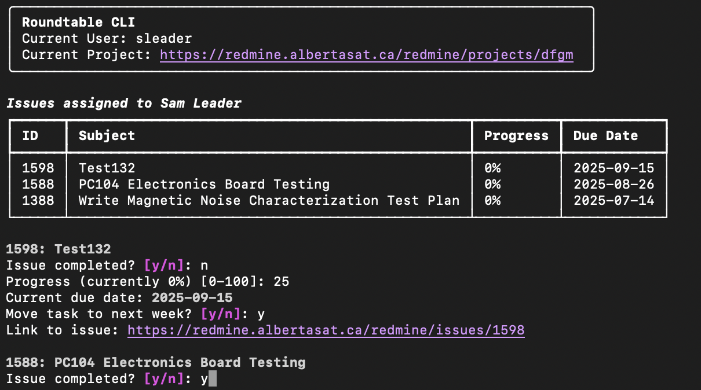

# Roundtable
A CLI to automate Redmine issue updates. Supports updating existing issues and creating new ones

## Installation
1. Install poetry (I used `brew install poetry` on MacOS)
2. Install dependencies: `poetry install`
3. Add your Redmine url and api key to your env. It can be done temporarily by doing:
    - `export REDMINE_API_KEY='api key here'`
    - `export REDMINE_URL='https://link.to.redmine'`
4. Run `poetry run python roundtable.py --help` to see the available commands